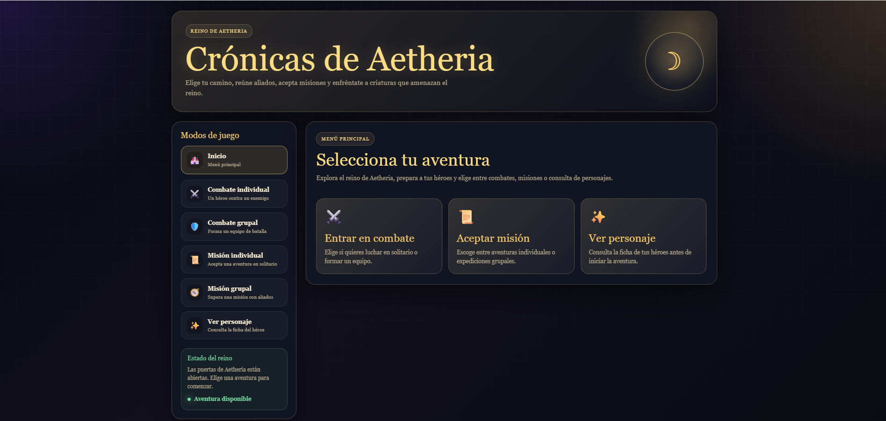
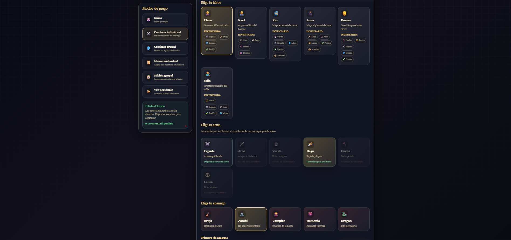
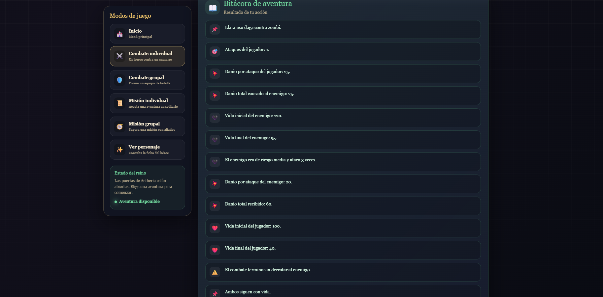
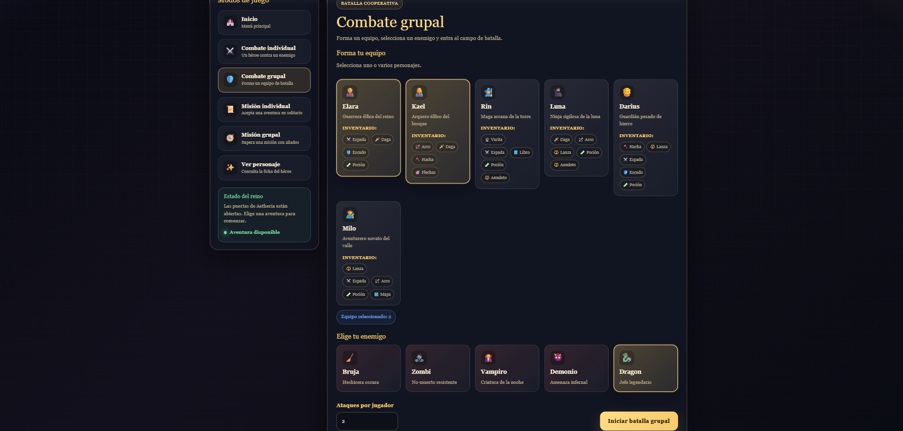
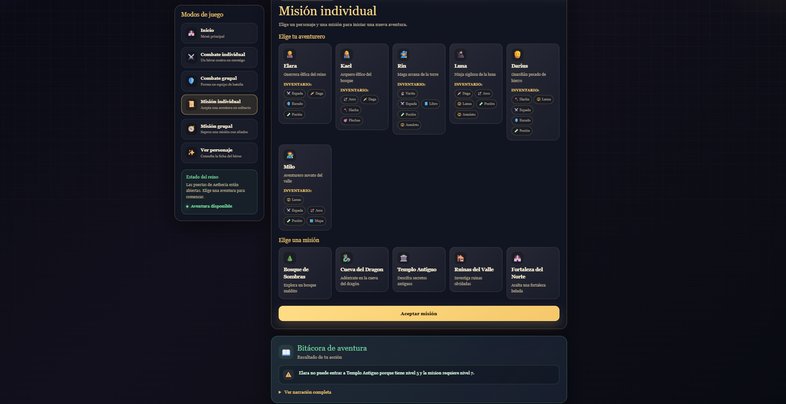
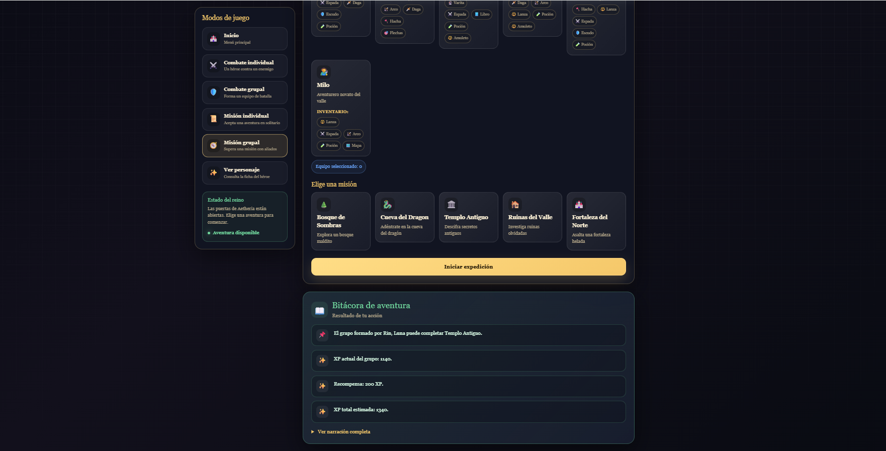
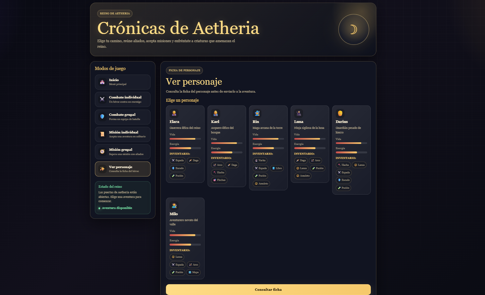

# Simulador de Juego RPG con Laravel y Prolog

## Objetivo

Implementar una aplicacion web en Laravel que use una base de conocimiento en Prolog para simular acciones de un juego RPG.

Laravel funciona como interfaz grafica y Prolog se encarga de resolver la logica del juego: personajes, enemigos, armas, misiones, inventario, vida, danio y experiencia.

## Tecnologias utilizadas

* Laravel
* PHP
* Blade
* Bootstrap
* SWI-Prolog
* Git y GitHub

## Funcionalidades

El sistema permite jugar en distintos modos:

* **Partida en solitario:** se elige un personaje, un arma, un enemigo y la cantidad de ataques.
* **Partida en grupo:** se seleccionan varios personajes para atacar a un enemigo.
* **Mision individual:** se valida si un personaje puede entrar a una mision segun nivel e inventario.
* **Mision grupal:** se valida si un grupo cumple los requisitos de una mision.
* **Estado del jugador:** se consulta nivel, vida, clase, inventario y XP acumulada.

## Reglas principales

La base de conocimiento en Prolog incluye reglas para:

* Calcular XP acumulada.
* Verificar requisitos de misiones.
* Calcular danio individual y grupal.
* Determinar vida restante de jugadores y enemigos.
* Simular ataques aleatorios del enemigo.
* Evaluar si el jugador gana, pierde, ambos caen o ambos siguen con vida.

## Capturas del sistema

### Pantalla principal

Vista inicial del simulador RPG, donde se muestran las opciones principales del sistema.



### Combate individual

Formulario donde se selecciona un personaje, un arma, un enemigo y la cantidad de ataques.



### Resultado del combate individual

Resultado generado luego de ejecutar una partida en solitario, mostrando el estado final del combate.



### Combate grupal

Vista donde se seleccionan varios personajes para atacar a un enemigo en grupo.



### Misión individual

Validación de una misión para un personaje según sus requisitos de nivel e inventario.



### Misión grupal

Validación de una misión en la que participa un grupo de personajes.



### Estado del personaje

Consulta del estado del personaje, incluyendo clase, nivel, vida, inventario y experiencia acumulada.



## Estructura principal

```text
app/Http/Controllers/JuegoController.php
app/Services/PrologService.php
prolog/base_conocimiento.pl
resources/views/juego/index.blade.php
routes/web.php
```

## Autor

Leonor Molina
